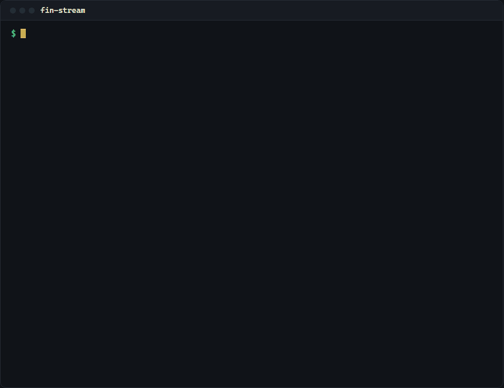
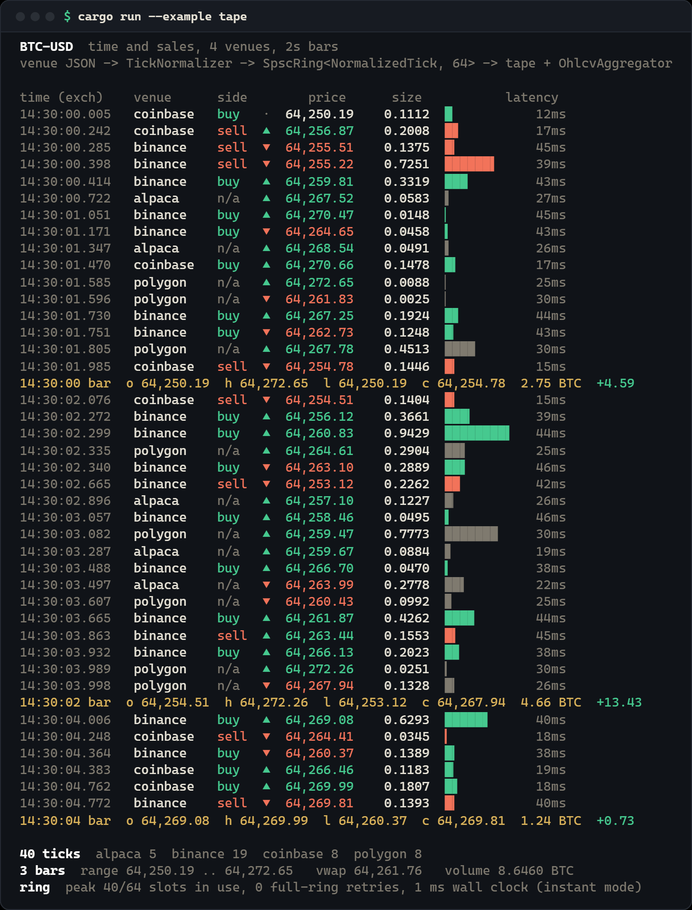
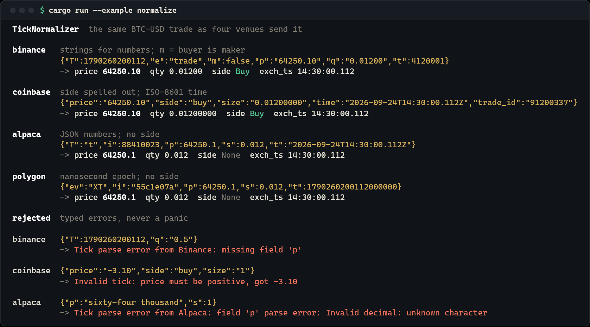
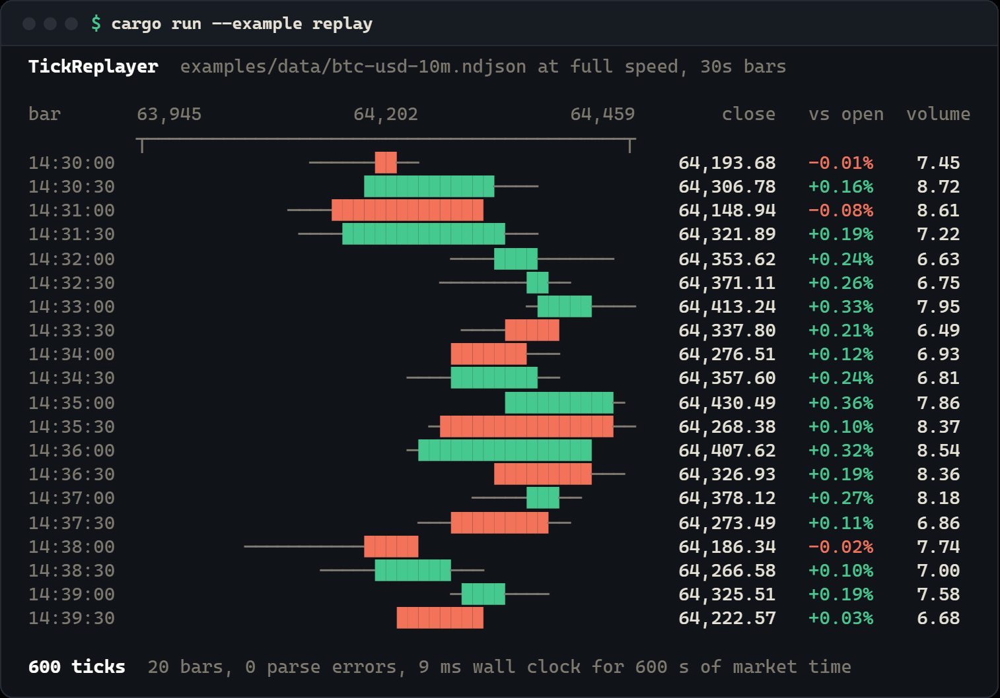

# fin-stream

[English](README.md) | [简体中文](README.zh-CN.md) | 日本語 | [한국어](README.ko.md)

**Binance、Coinbase、Alpaca、Polygon のリアルタイム約定メッセージを受け取り、正確な価格を持つ 1 つのティック形式にそろえ、ロックフリーのリングバッファでスレッド間を受け渡し、OHLCV のローソク足にまとめる Rust のライブラリ。**

トレーディングボット、マーケットデータ収集ツール、バックテスター、暗号資産や株式の分析ツールを Rust で作っていて、取引所との接続まわりの配管仕事は一度で済ませたい開発者向けです。

<p align="center">
  <a href="https://crates.io/crates/fin-stream"></a>
  <a href="https://docs.rs/fin-stream"></a>
  <a href="https://gitlab.com/mattbusel/fin-stream/-/blob/main/LICENSE"></a>
</p>

<p align="center">
  
</p>

## インストール

```bash
cargo add fin-stream serde_json
```

ライブラリなので、ダウンロードやシステムへのインストールは不要です（Rust 1.81 以降、
CI で確認済み）。`wss://` フィードの TLS は ring プロバイダーを使った rustls なので、OpenSSL も cmake も要りません。
`serde_json` は、`json!` で生のペイロードを組み立てられるようにするためだけに入れています。`Cargo.toml` に書くなら
`fin-stream = "2.12"` です。まず動くところを見たい？`git clone https://gitlab.com/mattbusel/fin-stream && cd fin-stream && cargo run --example tape`。

## 仕組み

`WsManager` は取引所との WebSocket をつないだまま保ち（切れたらバックオフしながら再接続）、
テキストフレームを 1 つずつ渡します。フレームを `RawTick` で包むと、`TickNormalizer` が 4 つの取引所の
どの形式でも、価格と数量が `Decimal` の 1 つの `NormalizedTick` に変換します。フィードスレッドがティックを
`SpscRing` に積み、あなたのスレッドがそれを取り出し、そこから足や特徴量、そのほか何にでも回せます。
板の深さメッセージは `OrderBook` に入り、クロスした板やシーケンス番号の欠落は拒否されます。

<p align="center"></p>

## fin-stream を選ぶ理由

- **4 つの取引所、1 つのティック型**：Binance と Coinbase（暗号資産）、Alpaca と Polygon（米国株）が
  すべて、価格と数量が正確な `Decimal` の同じ `NormalizedTick` になります。
  [`barter-data`](https://crates.io/crates/barter-data) はより多くの暗号資産取引所に対応していますが、
  株式のフィードはありません。fin-stream の株式ティックを barter のコードに渡すには、下の `barter` feature を使ってください。
- **落ちない接続ループ**：`WsManager` はバックオフしながら再接続し、接続が確立するたびにリトライの
  上限をリセットし、黙ってハーフオープンになった接続を張り替え、受信側をドロップした時点で
  すぐに止まります。これらの経路はモックではなく、ローカルで動かした本物の WebSocket サーバーに対してテストしています。
- **信頼できない入力でも panic しない**：JSON ノーマライザーと FIX 4.2 パーサーは、
  ランダムなペイロードとランダムなバイト列でプロパティテストしています。
- **計測済み、他が勝つ部分も含めて**（[bench/competitors](bench/competitors/README.md)）：
  1 スレッドでプッシュとポップを行う場合、`SpscRing` は毎秒約 12 億回の操作をこなし、
  `rtrb`、`ringbuf`、crossbeam の `ArrayQueue` を上回りました。2 スレッド間では `rtrb` と
  `ringbuf` のほうが速い結果でした（毎秒約 1 億 4,600 万件と 1 億 3,900 万件、対して 1 億 2,100 万件）。
- **観測できる**：`metrics` feature を有効にすると、接続数、再接続数、メッセージ数、バイト数、足の数、
  遅れて届いたティックの数が、インストールした任意のレコーダー（Prometheus、StatsD、
  OpenTelemetry）のカウンターになります。

## Feature フラグ

| feature | デフォルト | 追加されるもの |
|---|---|---|
| `fin-primitives` | あり | [fin-primitives](https://crates.io/crates/fin-primitives)（足、700 以上の指標、板、リスク）への `Tick::try_from(&NormalizedTick)` と、そのエラーへの `?` |
| `metrics` | なし | [`metrics`](https://crates.io/crates/metrics) ファサード経由のカウンター。一覧は `telemetry` モジュールのドキュメントにある |
| `grpc` | なし | リモートクライアントにティックをストリーム配信する tonic の gRPC サーバー（生成コードはリポジトリに含まれており、`protoc` は不要） |
| `barter` | なし | [barter-data](https://crates.io/crates/barter-data) の戦略向けの `PublicTrade::try_from(&NormalizedTick)` |

## サンプル

[`examples/`](examples/) に 4 つのプログラムが入っています。ネットワークも API キーも不要で、毎回同じ約定が流れます。
ターミナルではリアルタイムに流れ、パイプに出すと即座に全部表示されます。`NO_COLOR=1` で色をオフにできます。

| 実行するコマンド | 得られるもの |
|---|---|
| `cargo run --example tape` | 4 つの取引所の約定をフィードスレッドで正規化し、`SpscRing` を通して、リアルタイムの歩み値として表示しつつ 2 秒足にまとめる |
| `cargo run --example normalize` | 各取引所が送ってくる形の同じ約定 1 件と、それぞれが変換された 1 つの `NormalizedTick`、そして型付きの拒否 3 件 |
| `cargo run --example feed_health` | 4 つのフィードを見張る `HealthMonitor`：1 つが静かになり、stale になり、サーキットが開いて、復旧する |
| `cargo run --example replay` | 記録済みの NDJSON ファイルをライブフィードのトレイト経由で流し、30 秒足にまとめる |

**`tape`** はこのページの一番上の録画です。4 つの取引所の約定を 1 つの形式にそろえ、2 秒足が確定した瞬間に表示します。

**`feed_health`**（実際の出力、2026-09-28 に実行、`NO_COLOR=1`）：

```text
  binance   ││││││││││││││││││││││││││││││││││││││││││││││││  healthy   96 beats, last  0.0s ago
  coinbase  │││││││││····▒▒█████████││││││││││││││││││││││││  healthy   33 beats, last  0.0s ago
  alpaca    ·││·││·││·││·││·││·││·││·││·││·│···▒▒███████████  open      21 beats, last  8.2s ago
  polygon   ·····│·····│·····│·····│·····│·····│·····│·····│  healthy    8 beats, last  0.0s ago
            0s        5s        10s       15s       20s

  t+ 7.0s  coinbase  Feed 'coinbase' is stale: last tick was 2500ms ago (threshold: 2000ms)
  t+ 8.0s  coinbase  circuit OPEN after 3 stale checks
  t+12.5s  coinbase  heartbeat received, circuit closed
```

（`│` ハートビート、`·` 無通信、`▒` stale、`█` サーキットオープン。長くなるのでヘッダーと最後の数行は省略しています。）

<details>
<summary><b>tape</b>（全体）、<b>normalize</b>、<b>replay</b> の出力</summary>

<br>

<p align="center"></p>

<p align="center"></p>

<p align="center"></p>

</details>

## 3 ステップで使う

**1. プロジェクトを作ってクレートを追加する**

```bash
cargo new tick-demo && cd tick-demo
cargo add fin-stream serde_json
```

**2. これを `src/main.rs` に書く**

```rust
use fin_stream::tick::{Exchange, RawTick, TickNormalizer};
use serde_json::json;

fn main() -> Result<(), fin_stream::StreamError> {
    let normalizer = TickNormalizer::new();

    // One BTC trade each, in the JSON shape each exchange really sends.
    let trades = [
        (Exchange::Binance, json!({"p": "64251.30", "q": "0.40", "m": true, "t": 7, "T": 1790260201205u64})),
        (Exchange::Coinbase, json!({"price": "64250.10", "size": "0.012", "side": "buy"})),
        (Exchange::Alpaca, json!({"p": 64252.0, "s": 0.05, "i": 99})),
        (Exchange::Polygon, json!({"p": 64249.75, "s": 0.2, "i": "p-1"})),
    ];

    // Four formats in, one tick type out.
    for (venue, payload) in trades {
        let tick = normalizer.normalize(RawTick::new(venue, "BTC-USD", payload))?;
        let side = tick.side.map_or("n/a".to_string(), |s| s.to_string());
        println!("{:<9} {:<5} {:>6} BTC @ {}", tick.exchange.to_string(), side, tick.quantity, tick.price);
    }

    // Bad input is a typed error, not a panic.
    let broken = RawTick::new(Exchange::Binance, "BTC-USD", json!({"q": "1"}));
    println!("no price  -> {}", normalizer.normalize(broken).unwrap_err());
    Ok(())
}
```

**3. 実行する**

```bash
cargo run
```

次のように表示されます。

```text
Binance   sell    0.40 BTC @ 64251.30
Coinbase  buy    0.012 BTC @ 64250.10
Alpaca    n/a     0.05 BTC @ 64252.0
Polygon   n/a      0.2 BTC @ 64249.75
no price  -> Tick parse error from Binance: missing field 'p'
```

4 つの取引所は約定を 4 通りの書き方で送ってきますが、受け取るのはそれぞれ 1 つの `NormalizedTick` で、
価格と数量は正確な 10 進数です。どちらが仕掛けた側かを示さない取引所では、推測せずに
`n/a` と表示し、不正な形式のメッセージは match で処理できるエラーになります。このプログラムそのものが、
このリポジトリの `cargo test --doc` でコンパイル・実行されています。

## ドキュメント

| 読むもの | 内容 |
|---|---|
| [docs.rs/fin-stream](https://docs.rs/fin-stream) | すべての型とメソッド |
| [docs/EXAMPLES.md](docs/EXAMPLES.md) | 短いレシピ集：リングバッファ、足、ノーマライザー、板、フィードの健全性、取引セッション、Lorentz 特徴量 |
| [docs/ARCHITECTURE.md](docs/ARCHITECTURE.md) | 各モジュールの役割、対応取引所とそのワイヤーフィールド、設計ルール、ベンチマークの数値、取引所の追加方法 |
| [docs/REFERENCE.md](docs/REFERENCE.md) | モジュールガイド（複数フィードと NBBO の集約、サーキットブレーカー、フィード品質、異常検知、リプレイ、FIX 4.2、gRPC、OFI、VPIN、マーケットマイクロストラクチャー、相場レジームなど）、数式、API シグネチャ、すべての `StreamError` |
| [docs/TESTING.md](docs/TESTING.md) | テストとベンチマークの実行方法、現在のテスト状況 |
| [CHANGELOG.md](CHANGELOG.md) | 各バージョンの変更点 |
| [プロジェクトサイト](https://fin-stream-rs.vercel.app/) | 同じ概要をウェブページで |

オプションの gRPC サーバーは `grpc` feature で有効になります。メトリクス、相互運用などは
上の feature 表を参照してください。

> 研究・エンジニアリング用のライブラリです。注文は出さず、ここにある内容はいずれも投資助言ではありません。

## コントリビュート

Issue とプルリクエストを歓迎します。公開アイテムには `///` ドキュメントが必要で（`#![deny(missing_docs)]`）、
失敗しうるコードは `Result<_, StreamError>` を返し、新しい振る舞いにはテストが必要です。PR を出す前に `cargo fmt`、
`cargo clippy`、`cargo test --doc` を実行してください。取引所を追加するときは
[新しい取引所アダプターの追加](docs/ARCHITECTURE.md#adding-a-new-exchange-adapter)の手順に従ってください。

## ライセンスと関連プロジェクト

MIT。[LICENSE](LICENSE) を参照してください。[fin-primitives](https://gitlab.com/mattbusel/fin-primitives)
（チェック済みの価格と数量の型、板、指標、リスク）と組み合わせて使えます。ティックは
`fin_primitives::tick::Tick::try_from(&tick)` で変換します。`lorentz` モジュールは
特殊相対性理論の金融モデリング（Special Relativity Financial Modeling）の取り組みから来ています：[Special-Relativity-in-Financial-Modeling](https://gitlab.com/mattbusel/Special-Relativity-in-Financial-Modeling)、
[srfm-python](https://gitlab.com/mattbusel/srfm-python)、[srfm-paper-impl](https://gitlab.com/mattbusel/srfm-paper-impl)、[srfm-lab](https://gitlab.com/mattbusel/srfm-lab)。
