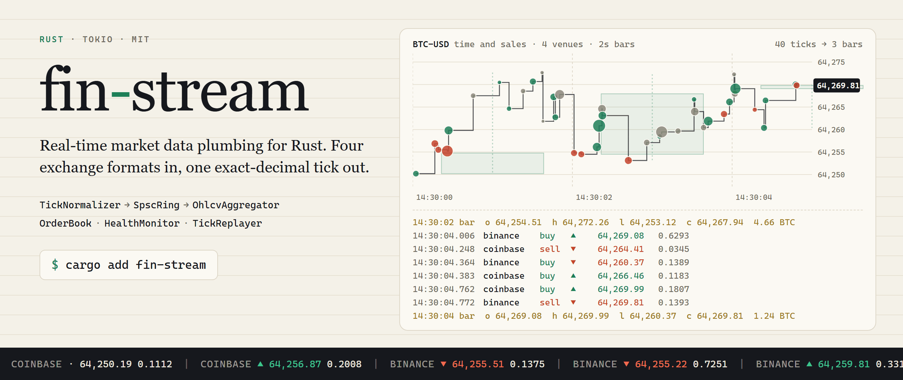

# fin-stream architecture

## Why this exists

Getting ticks from an exchange into a model involves the same plumbing every time:
parse four slightly different JSON shapes into one tick type, keep the WebSocket alive,
move ticks between threads, roll them into bars, and notice when a feed goes stale.
`fin-stream` packages that plumbing, with exact `Decimal` prices and a single
`StreamError` type, and adds a large set of microstructure analytics (OFI, VPIN, Kyle's
lambda, Amihud, regime detection) on top.

<p align="center">
  <picture>
    <source media="(prefers-color-scheme: dark)" srcset="../assets/hero-dark.png">
    
  </picture>
</p>

## What is included

| Module | Purpose | Key types |
|---|---|---|
| `ws` | WebSocket connection lifecycle with exponential-backoff reconnect and backpressure | `WsManager`, `ConnectionConfig`, `ReconnectPolicy` |
| `tick` | Convert raw exchange payloads (Binance/Coinbase/Alpaca/Polygon) into a single canonical form; 200+ batch analytics on tick slices | `RawTick`, `NormalizedTick`, `Exchange`, `TradeSide`, `TickNormalizer` |
| `ring` | Lock-free SPSC ring buffer: zero-allocation hot path between normalizer and consumers | `SpscRing<T, N>`, `SpscProducer`, `SpscConsumer` |
| `book` | Incremental order book delta streaming with snapshot reset and crossed-book detection | `OrderBook`, `BookDelta`, `BookSide`, `PriceLevel` |
| `ohlcv` | Bar construction at any `Seconds / Minutes / Hours` timeframe with optional gap-fill bars; 200+ batch analytics on bar slices | `OhlcvAggregator`, `OhlcvBar`, `Timeframe` |
| `health` | Per-feed staleness detection with configurable thresholds and a circuit-breaker | `HealthMonitor`, `FeedHealth`, `HealthStatus` |
| `session` | Trading-status classification (Open / Extended / Closed) for US Equity, Crypto, Forex | `SessionAwareness`, `MarketSession`, `TradingStatus` |
| `norm` | Rolling min-max and z-score normalizers for streaming observations; 80+ analytics each (moments, percentiles, entropy, trend, etc.) | `MinMaxNormalizer`, `ZScoreNormalizer` |
| `lorentz` | Lorentz spacetime transforms for feature engineering on price-time coordinates | `LorentzTransform`, `SpacetimePoint` |
| `correlation` | Streaming NxN Pearson correlation matrix; O(N) update via Welford's algorithm; DashMap-backed for concurrent feed updates | `StreamingCorrelationMatrix`, `CorrelationPair` |
| `fix` | FIX 4.2 session adapter: parse/serialize frames, validate checksum (tag 10), Logon, MarketDataRequest, Snapshot/Refresh → NormalizedTick | `FixSession`, `FixParser`, `FixMessage`, `FixError` |
| `portfolio_feed` | Multi-asset parallel WebSocket feed; JoinSet-managed per-asset WsManager tasks; exponential-backoff restart; merged tick channel | `PortfolioFeed`, `AssetFeedConfig`, `AssetFeedStats` |
| `mev` | MEV detection scaffold: sandwich, frontrun, and backrun heuristics on tick slices; no Flashbots API required | `MevDetector`, `MevCandidate`, `MevPattern` |
| `toxicity` | Order flow toxicity: PIN, VPIN, Kyle λ, Amihud illiquidity, four-metric smart-money detection | `OrderFlowToxicityAnalyzer`, `ToxicityMetrics`, `VpinCalculator` |
| `ofi` | Order flow imbalance: per-tick OFI from top-of-book delta, rolling accumulator, z-score standardization, VPIN | `OrderFlowImbalance`, `OfiAccumulator`, `OfiMetricsComputer`, `ToxicityEstimator`, `VpinResult` |
| `microstructure` | Market microstructure analytics: Amihud illiquidity, Kyle's lambda, Roll spread, bid-ask bounce, streaming monitor | `MicrostructureMonitor`, `AmihudIlliquidity`, `KyleImpact`, `RollSpread`, `BidAskBounce`, `MicrostructureReport` |
| `regime` | Real-time market regime classification: Trending / MeanReverting / HighVol / LowVol via Hurst + ADX + realised vol | `RegimeDetector`, `MarketRegime` |
| `synthetic` | Stochastic market data generator: GBM, jump-diffusion, OU, Heston, deterministic seeded output | `SyntheticMarketGenerator`, `GeometricBrownianMotion`, `HestonModel` |
| `multi_exchange` | NBBO-style multi-exchange aggregation; per-exchange latency divergence tracking; arbitrage opportunity detection | `MultiExchangeAggregator`, `Nbbo`, `ArbitrageOpportunity`, `AggregatorConfig` |
| `circuit_breaker` | WebSocket circuit breaker: exponential-backoff reconnect + degraded-mode synthetic tick emission after 5 failures | `WsCircuitBreaker`, `CircuitBreakerConfig`, `CircuitState` |
| `anomaly` | Streaming tick anomaly detection: price spikes (z-score), volume spikes, sequence gaps, timestamp inversions | `TickAnomalyDetector`, `AnomalyEvent`, `AnomalyKind`, `AnomalyDetectorConfig` |
| `snapshot` | Binary tick recorder and N-speed replayer for backtesting with real captured tick data | `TickRecorder`, `TickReplayer` |
| `grpc` | gRPC streaming endpoint (`grpc` feature): expose tick stream over gRPC via tonic with per-symbol/exchange filtering | `TickStreamServer` (feature-gated) |
| `quality` | Feed quality scoring: rolling latency percentiles, gap detection, duplicate detection, 0–100 composite score | `QualityScorer`, `FeedQualityMetrics`, `FeedGapDetector`, `TickDeduplicator`, `QualityReport` |
| `circuit` | Per-symbol circuit breakers: halt on price spikes or volume surges; Normal/Halted/Recovering FSM; hub manages one breaker per symbol | `SymbolCircuitBreaker`, `CircuitBreakerHub`, `HaltConfig`, `HaltReason`, `CircuitDecision`, `CircuitStats` |
| `error` | Unified typed error hierarchy covering every pipeline failure mode | `StreamError` |

## Supported exchanges

| Exchange | Adapter | Status | Wire-format fields used |
|---|---|---|---|
| Binance | `Exchange::Binance` | Stable | `p` (price), `q` (qty), `m` (maker/taker), `t` (trade id), `T` (exchange ts) |
| Coinbase | `Exchange::Coinbase` | Stable | `price`, `size`, `side`, `trade_id` |
| Alpaca | `Exchange::Alpaca` | Stable | `p` (price), `s` (size), `i` (trade id) |
| Polygon | `Exchange::Polygon` | Stable | `p` (price), `s` (size), `i` (trade id), `t` (exchange ts) |

All four adapters are covered by unit and integration tests. To add a new exchange,
see [Adding a new exchange adapter](#adding-a-new-exchange-adapter).

## Architecture

<p align="center"></p>

`WsManager` hands you raw text frames; you wrap each one in a `RawTick` and
`TickNormalizer` turns it into a `NormalizedTick`. From there every stage takes and
returns plain values, so the stages compose in whatever order your system needs: merge
feeds with `FeedAggregator`, move ticks to a worker thread with `SpscRing`, then bars,
books, normalizers and analytics. `TickReplayer` implements the same `TickSource` trait a
live feed would, so strategy code runs unchanged against recorded data.

## Design principles

1. **Errors are values.** Fallible operations return `Result<_, StreamError>`, including
   constructors that validate their arguments (`MinMaxNormalizer::new(0)` returns
   `Err`, it does not panic). The crate denies `unwrap_used`, `expect_used` and `panic`
   in Clippy. The synthetic price models are the exception: their constructors `assert!`
   on impossible parameters such as a non-positive starting price.
2. **Exact decimal arithmetic for prices.** Price and quantity fields are
   `rust_decimal::Decimal`, never `f64`. Venues that send prices as JSON strings
   (Binance, Coinbase) are parsed straight into `Decimal`. Venues that send JSON numbers
   (Alpaca, Polygon) go through `serde_json`'s number type first, which holds an `f64`,
   so `64250.10` arrives as `64250.1`; that is exact for any price with up to 15
   significant digits. `f64` is also used for dimensionless statistics (normalized
   values, z-scores, Lorentz parameters).
3. **No allocation inside the ring.** `SpscRing<T, N>` allocates its `N` slots once in
   `new()`; `push` and `pop` are an atomic load, a slot write or read, and an atomic
   store, with no locking and no allocation. `N` must be a power of two, checked at
   compile time. Note that `NormalizedTick` itself owns a `String` symbol and an optional
   `String` trade id, so creating a tick allocates; moving it through the ring does not.
4. **Thread safety where it is needed.** `HealthMonitor`, the correlation matrix and the
   multi-symbol managers use `DashMap`. `SpscRing::split` returns a producer and a
   consumer half that can each move to their own thread.
5. **Unsafe code is confined to the ring buffer.** `src/ring/` uses `UnsafeCell` and
   `MaybeUninit` with documented safety invariants behind a safe API; the rest of the
   crate is safe Rust.

## Performance

Measured with the Criterion suite in `benches/tick_hot_path.rs` on one machine
(Intel Core i7-13700KF, Windows 11, rustc 1.91, `bench` profile with thin LTO), on
2026-09-25. Each figure is the Criterion median for one iteration of the benchmark body,
single-threaded.

| Benchmark | Median | What one iteration does |
|---|---:|---|
| `ring_push_pop_u64` | 2.3 ns | push one `u64` into `SpscRing<u64, 128>` and pop it back |
| `ring_push_pop_normalized_tick` | 52.8 ns | build a `NormalizedTick` (allocates its symbol `String`), push, pop |
| `tick_normalize_binance` | 714 ns | clone a Binance JSON payload into a `RawTick` and normalize it |
| `tick_normalize_coinbase` | 831 ns | build a Coinbase JSON payload and normalize it |
| `ohlcv_feed_same_window` | 101 ns | build a tick and feed it into an open 1-minute bar |
| `ohlcv_feed_bar_completion` | 200 ns | build a tick that closes the current 1-second bar |
| `order_book_apply_delta` | 64.8 ns | apply one bid-level update to a two-sided book |
| `order_book_best_levels` | 11.7 ns | read best bid and best ask from a 10-level book |

Normalization is the costly step, and most of that cost is JSON handling (the payload
clone and field lookups) rather than the decimal parse. At roughly 0.7 to 0.8 us per tick
it works out to over a million normalized ticks per second on one core; the ring and bar
stages are one to two orders of magnitude cheaper. These are single-thread
microbenchmarks, not an end-to-end throughput test across threads. To reproduce:

```bash
cargo bench --bench tick_hot_path
```

## Contributing workflow

1. Fork the repository and create a feature branch.
2. Add or update tests for any changed behaviour.
3. Run `cargo fmt` before opening a pull request.
4. Keep public APIs documented with `///` doc comments; `#![deny(missing_docs)]`
   is active in `lib.rs`, undocumented public items cause a build failure.
5. Open a pull request against `main`. CI (`.github/workflows/ci.yml`) runs
   `cargo check`, the doctests, the integration tests and the examples; please also
   run `cargo clippy` locally.

## Adding a new exchange adapter

1. Add the variant to `Exchange` in `src/tick/mod.rs` with a `///` doc comment.
2. Implement `Display` and `FromStr` for the new variant in the same file.
3. Add a `normalize_<exchange>` method following the pattern of `normalize_binance`.
4. Wire the method into `TickNormalizer::normalize` via the match arm.
5. Add unit tests covering: happy-path, each required missing field returning
   `StreamError::ParseError`, and an invalid decimal string.
6. Update the "Supported exchanges" table in this file and `CHANGELOG.md` `[Unreleased]`.
